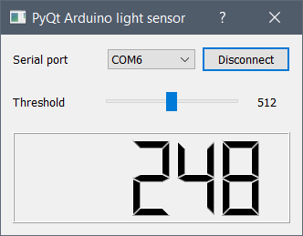
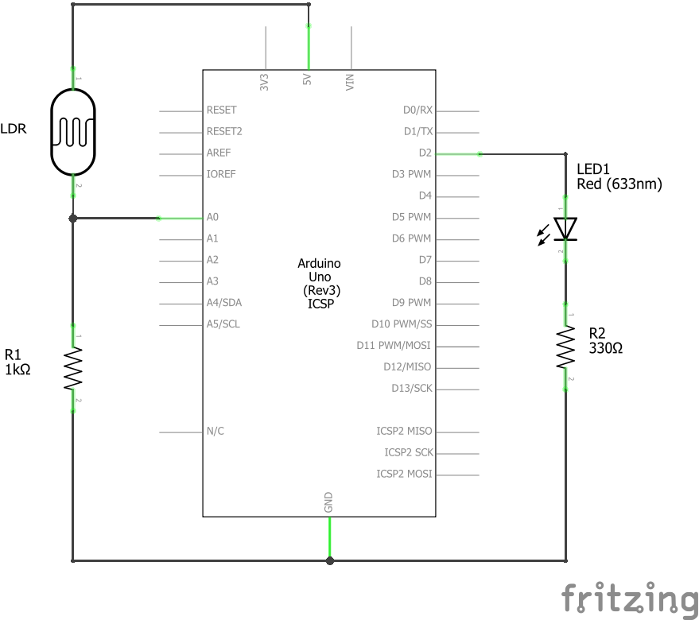

# pyqt-arduino-ldr-sensor
## About

A simple PyQt interface for an Arduino based light sensor.

## Prerequisites

```
pip install pyserial pyqt5
```

## Screenshot



## Schematic


## Acknowledgments

- [Qt-Temperature-Sensor](https://github.com/vannevar-morgan/Qt-Temperature-Sensor)
- [ArduinoPySerial_LearningSeries](https://github.com/WaveShapePlay/ArduinoPySerial_LearningSeries)